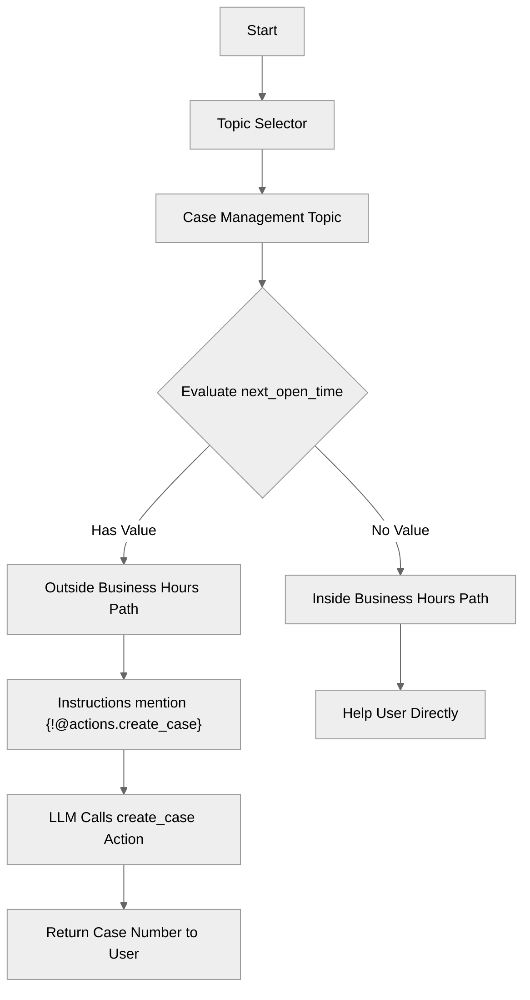

# InstructionActionReferences

## Overview

Learn how to **reference actions directly** within your reasoning instructions. This technique helps guide the LLM to use specific actions in specific contexts by explicitly mentioning them in the instruction text. Combined with dynamic variable expressions, you can create contextual, targeted prompts that improve action selection accuracy.

## Agent Flow



## Key Concepts

- **Action References**: `{!@actions.action_name}` embeds a reference to the action definition directly in the instruction text, signaling to the LLM that this tool is relevant.
- **Variable Expressions**: `{!@variables.name}` injects dynamic variable values into instructions for contextual prompts.
- **Procedural If Blocks**: Use `if @variables.name:` to conditionally include different instruction blocks based on variable state.
- **Targeted Tool Guidance**: By naming actions in instructions, you increase the likelihood the LLM will select the appropriate tool.

## How It Works

### Why Reference Actions in Instructions?

When the LLM receives a list of available actions, it must decide which one to use based on the user's request. By explicitly mentioning an action in the instruction text using `{!@actions.action_name}`, you create a stronger association between the context and the tool. This is particularly useful when:

- Multiple actions could apply, but one is preferred in a specific situation
- You want to ensure a particular workflow is followed
- The action name alone doesn't fully convey when it should be used

### The Conditional Instruction Pattern

This recipe demonstrates combining action references with procedural logic. The `if` block checks whether `next_open_time` has a value:

```agentscript
if @variables.next_open_time:
   | We are currently OUTSIDE business hours...
     Create a support case using {!@actions.create_case}...
else:
   | We are currently WITHIN business hours...
```

When the condition is true, the instruction block that mentions `create_case` is included, guiding the LLM to use that specific action.

### How Template Expressions Resolve

The `{!@actions.create_case}` expression doesn't just insert the action name—it embeds a reference to the full action definition. This gives the LLM richer context about the action's purpose, inputs, and outputs when making its decision.

Similarly, `{!@variables.next_open_time}` resolves to the actual variable value (e.g., "9:00 AM Tomorrow"), allowing the agent to communicate dynamic information to the user.

## Key Code Snippets

### Variable Declaration

```agentscript
variables:
   next_open_time: mutable string = "9:00 AM Tomorrow"
```

### Action Definition

```agentscript
actions:
   create_case:
      description: "Creates a support case"
      inputs:
         subject: string
            description: "Subject of the case"
      outputs:
         case_number: string
            description: "The created case number"
      target: "flow://CreateCase"
```

### Conditional Instructions with Action Reference

```agentscript
reasoning:
   instructions:->
      | If the user has an issue that requires support, please help them.

      if @variables.next_open_time:
         | We are currently OUTSIDE business hours. Support opens at {!@variables.next_open_time}.
           Create a support case using {!@actions.create_case} and share the Case Number.
      else:
         | We are currently WITHIN business hours. Support is available now.
           Help the user resolve their issue directly.
   actions:
         create_case: @actions.create_case
            with subject=...
```

## Try It Out

### Example Interaction

```text
Agent: Hi! I can help you create support cases. If the user has an issue that requires support, please help them.

User: I'm having trouble logging into my account.

Agent: I understand you're having login issues. Since we're currently outside business hours, I've created a support case for you.

Your Case Number is 00001234. Our support team will follow up with you when we reopen at 9:00 AM Tomorrow.
```

### Behind the Scenes

1. The user describes a login issue
2. The reasoning block evaluates `next_open_time` and finds it has a value
3. The conditional instruction mentioning `{!@actions.create_case}` is included
4. The LLM recognizes the action reference and calls `create_case` with an appropriate subject
5. The flow returns a case number, which the agent shares along with the follow-up time

## What's Next

- **PromptTemplateActions**: Use Salesforce Prompt Templates for more complex generation scenarios.
- **AdvancedInputBindings**: Learn more ways to bind inputs to actions dynamically.
- **BeforeAfterReasoning**: Explore pre- and post-action reasoning patterns.
