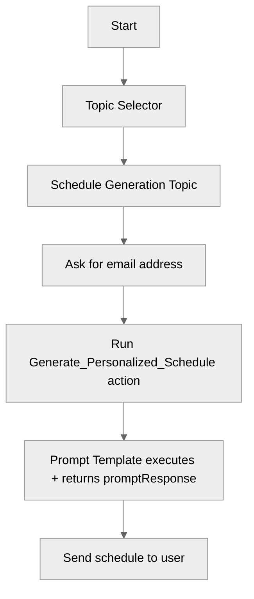

# PromptTemplateActions

## Overview

Learn how to **invoke Salesforce Prompt Templates** from an Agent Script agent as an **action**. This recipe demonstrates how to pass prompt inputs (like an email address) into a prompt template and return the generated response back to the user, while keeping the agent logic simple and repeatable.

## Agent Flow



## Key Concepts

- **Prompt Template action targets**: Use `generatePromptResponse://<PromptTemplateDeveloperName>` to execute a prompt template and return a `promptResponse` string.
- **Prompt Template inputs**: Prompt inputs are passed using the `Input:<apiName>` reference name (for example, `Input:email`).
- **Grounded data via data providers**: Prompt templates can pull grounded data via data providers (for example, an Apex data provider referenced from the template).
- **Topic-scoped execution**: Keep the “ask for missing input” + “run the action” logic inside a focused topic so the agent stays predictable.

## How It Works

### 1. Create (or reference) a Prompt Template

This recipe includes a prompt template asset named `Generate_Personalized_Schedule` (`genAiPromptTemplates/Generate_Personalized_Schedule.genAiPromptTemplate-meta.xml`). The template:

- Accepts an `email` input (referenced as `Input:email`)
- Uses a data provider (Apex) to retrieve grounded, relevant activities for that guest
- Produces a single text response that the agent can display to the user

### 2. Define an Agent Script action that targets the template

In the agent file (`aiAuthoringBundles/PromptTemplateActions/PromptTemplateActions.agent`), the action is defined with:

- A required input named `"Input:email"` (matching the prompt template input reference name)
- An output named `promptResponse` (the standard response field returned by the prompt execution)
- A `target` pointing at the prompt template by developer name using `generatePromptResponse://...`

This indirection is useful because the agent can treat the prompt template like any other action: inputs in, outputs out.

### 3. Ask for required input, then run the action

The `schedule_generation` topic is responsible for collecting the email address. Once the user provides it, the topic runs the action and uses the returned `promptResponse` as the content of the next message.

This pattern keeps the conversation clean:

- The agent only asks for the one required input it truly needs
- The prompt template stays responsible for the “heavy lifting” (content generation and grounded context)

## Key Code Snippets

### Action Definition

```agentscript
actions:
  Generate_Personalized_Schedule:
    description: "Generate a personalized schedule with a prompt template."
    inputs:
      # Prompt Template inputs follow the pattern: "Input:<Field API Name>"
      "Input:email": string
        description: "User's email address"
        is_required: True
    outputs:
      # Prompt Template output is always a promptResponse string
      promptResponse: string
        description: "The prompt response generated by the action based on the specified prompt and input."
        is_used_by_planner: True
        is_displayable: True
    target: "generatePromptResponse://Generate_Personalized_Schedule"
```

### Action Usage (Topic Instructions)

```agentscript
| When a user asks for help scheduling their day or creating a personalized schedule:
| 1. Ask for their email address
| 2. When you have the email address, run {!@actions.Generate_Personalized_Schedule}
| 3. Output the personalized schedule in a message
```

## Try It Out

### Example Interaction

```text
Agent: Hi! I can generate personalized schedules using Prompt Templates.

User: Generate a personalized schedule of experiences for me.

Agent: To create a personalized schedule for you, please provide your email address.

User: alex.reed@xample.com

Agent: Here is your personalized schedule of experiences ...

```

## What's Next

- **AdvancedInputBindings**: Explore richer ways to bind variables and inputs into actions.
- **ActionDefinitions**: Learn how to define and document actions the planner can select automatically.
- **ActionCallbacks**: Add post-processing logic (validation, formatting, side effects) after an action runs.
