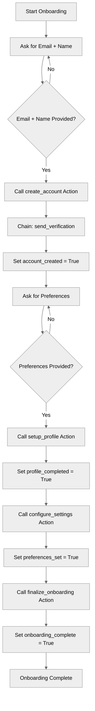

# MultiStepWorkflows Agent

## Overview

This recipe demonstrates how to orchestrate **multi-step workflows** where actions are chained together in sequence. Learn how to build onboarding processes with multiple steps, pass data between actions, and track progress through boolean state flags.

## Agent Flow



## Key Concepts

- **Action chaining**: Using `run` to execute follow-up actions automatically
- **Step-by-step workflows**: Guided multi-step processes with clear progression
- **Progress tracking**: Boolean flags to track completion of each step
- **Data flow**: Outputs from one action feed into subsequent actions
- **Procedural instructions**: Step-by-step rules that guide the LLM through the workflow

## How It Works

### Workflow State Variables

Track progress with boolean flags and store data needed across steps:

```agentscript
variables:
   customer_email: mutable string = ""
   customer_id: mutable string = ""
   account_created: mutable boolean = False
   profile_completed: mutable boolean = False
   preferences_set: mutable boolean = False
   onboarding_complete: mutable boolean = False
   verification_token: mutable string = ""
   step: mutable number = 0
```

### Step-by-Step Instructions

Use procedural instructions to guide the workflow through each step:

```agentscript
reasoning:
   instructions: ->
      | Follow the below Rules step by step
        Rules:
        Step 1:
           First step is to create Account with the name and customer email
           If not provided you will ask for it and you won't proceed.
           After Step 1 please proceed to Step 2
        Step 2:
           Before setting up the customer's profile,
           Ask the customer about their preferences:
              1. Notification preferences (email, SMS, or both)
              2. Preferred language
              3. Timezone
           Collect all this info and call it 'preferences'.
        Only proceed with setup_profile action after you have preferences.
        After Step 2 please proceed to Step 3
        Step 3:
           Before configuring account settings, ask the customer about:
              1. Default notification settings
              2. Privacy preferences
           Collect all this info and call it 'settings'.
        Only proceed with configure_settings action after you have settings.
        After Step 3 please proceed to Step 4
        Step 4:
           This is the final action.
           Execute finalize_onboarding
           Tell customer they have completed onboarding successfully
```

### Action with Chained Follow-up

The `run` keyword chains a follow-up action immediately after the primary action completes:

```agentscript
actions:
   create_account: @actions.create_account
      with email = ...
      with name = ...
      set @variables.customer_id = @outputs.customer_id
      set @variables.account_created = @outputs.success
      set @variables.customer_email = @outputs.customer_email
      # Chain a follow-up action
      run @actions.send_verification
         with customer_id = @variables.customer_id
         with email = @variables.customer_email
         set @variables.verification_token = @outputs.token
```

## Key Code Snippets

### Action Definitions

```agentscript
actions:
   create_account:
      description: "Creates a new customer account"
      inputs:
         email: string
            description: "Customer's email address"
         name: string
            description: "Customer's full name"
      outputs:
         customer_id: string
            description: "Unique identifier for the new account"
         success: boolean
            description: "Whether account was created"
         customer_email: string
            description: "Customer email"
      target: "flow://CreateCustomerAccount"

   send_verification:
      description: "Sends email verification"
      inputs:
         customer_id: string
            description: "Customer to send verification to"
         email: string
            description: "Email address for verification"
      outputs:
         token: string
            description: "Verification token"
         sent: boolean
            description: "Whether email was sent"
      target: "flow://SendVerificationEmail"

   setup_profile:
      description: "Creates customer profile with preferences"
      inputs:
         customer_id: string
            description: "Customer to set up profile for"
         preferences: string
            description: "Customer preferences"
      outputs:
         profile_id: string
            description: "Profile identifier"
         success: boolean
            description: "Whether profile was created"
      target: "flow://SetupCustomerProfile"

   configure_settings:
      description: "Sets default account settings"
      inputs:
         customer_id: string
            description: "Customer to configure"
         settings: string
            description: "Account settings"
      outputs:
         success: boolean
            description: "Whether settings were configured"
      target: "flow://ConfigureAccountSettings"

   finalize_onboarding:
      description: "Marks onboarding as complete and sends welcome email"
      inputs:
         customer_id: string
            description: "Customer to finalize"
      outputs:
         success: boolean
            description: "Whether onboarding was finalized"
         welcome_sent: boolean
            description: "Whether welcome email was sent"
      target: "flow://FinalizeOnboarding"
```

### Reasoning Actions

```agentscript
actions:
   create_account: @actions.create_account
      with email = ...
      with name = ...
      set @variables.customer_id = @outputs.customer_id
      set @variables.account_created = @outputs.success
      set @variables.customer_email = @outputs.customer_email
      run @actions.send_verification
         with customer_id = @variables.customer_id
         with email = @variables.customer_email
         set @variables.verification_token = @outputs.token

   setup_profile: @actions.setup_profile
      with customer_id = ...
      with preferences = ...
      set @variables.profile_completed = @outputs.success

   configure_settings: @actions.configure_settings
      with customer_id = ...
      with settings = ...
      set @variables.preferences_set = @outputs.success

   finalize_onboarding: @actions.finalize_onboarding
      with customer_id = ...
      set @variables.onboarding_complete = @outputs.success
```

## Try It Out

### Example Interaction

```text
Agent: Welcome! Let's get you onboarded step by step to our platform. I'll guide you
       through the process. Please provide your email and name to begin the onboarding
       process.

User: john.smith@gmail.com, John Smith

Agent: Step 1 of 4: Account Creation

       Your account is being created with the following details:
       Name: John Smith
       Email: john.smith@gmail.com

       Step 1 is complete!

       Step 2 of 4: Please share any preferences you have (for example, communication
       preferences, interests, or anything you'd like us to know to personalize your
       experience).

User: communication preferences - keep everything private
      No other preference

Agent: Step 2 of 4: Preferences Set

       Your communication preference has been noted: everything will be kept private.

       Step 3 of 4: Your privacy settings are now configured to "all private" for
       maximum confidentiality.

       Step 4 of 4: Onboarding is complete! A welcome message has been sent to your
       email.

       You are all set. If you have any questions or need further assistance, feel
       free to ask!
```

### Behind the Scenes

1. **Step 1**: Agent calls `create_account` with email and name, then chains `send_verification`
2. **Step 2**: Agent calls `setup_profile` with collected preferences
3. **Step 3**: Agent calls `configure_settings` with privacy settings
4. **Step 4**: Agent calls `finalize_onboarding` to complete the process

## Workflow Patterns

### Linear Workflow

Steps execute in a fixed order:

```text
Step 1 → Step 2 → Step 3 → Step 4 → Complete
```

### Action Chaining with `run`

Execute a follow-up action immediately after the primary action:

```agentscript
primary: @actions.primary_action
   with input = ...
   set @variables.result = @outputs.value
   run @actions.follow_up
      with data = @variables.result
```

**Note**: Only one level of nesting is allowed for chained actions.

## Best Practices

- **Track State Clearly**: Use descriptive boolean flags like `account_created` and `profile_completed`
- **Provide Progress Feedback**: Show users which step they're on (e.g., "Step 2 of 4")
- **Validate Before Each Step**: Ensure required data is collected before calling actions
- **Handle Partial Completion**: Allow users to resume where they left off

## What's Next

- **ActionCallbacks**: Learn more about the `run` keyword for chaining actions
- **MultiTopicOrchestration**: Split complex workflows across multiple topics
- **ErrorHandling**: Handle step failures gracefully

## Testing

### Test Case 1: Complete Happy Path

- Execute all 4 steps in sequence
- Verify state updates correctly at each step
- Confirm final completion message

### Test Case 2: Resume from Step 2

- Set `account_created=True` and `customer_id="..."`
- Start conversation
- Agent should continue at step 2

### Test Case 3: Data Flow Verification

- Verify `customer_id` from step 1 is used in steps 2-4
- Confirm all state persists across the conversation
